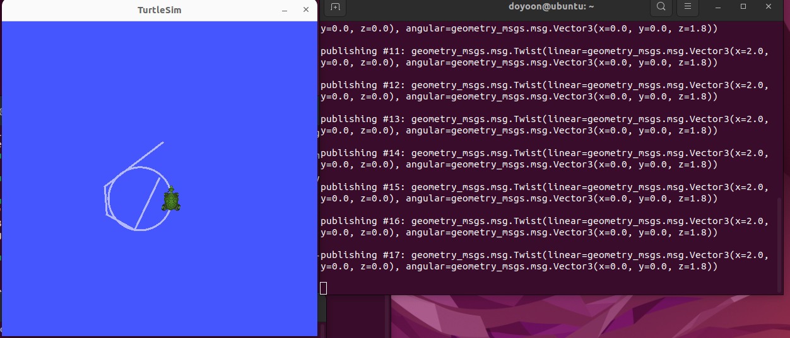

# Day2 4.2 실습 미션② 

```bash

ros2 topic pub --rate 1 /turtle1/cmd_vel geometry_msgs/msg/Twist \
"{linear: {x: 2.0}, angular: {z: 1.8}}"
```



## 확인포인트 
회전은 앞서 학습한 linear.x와 angular.z의 비율로 정할 수있다.  


