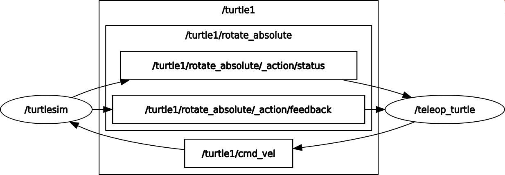
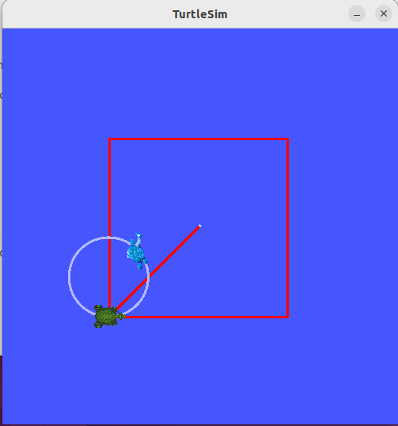

```bash

ros2 service call /spawn turtlesim/srv/Spawn \
"{x: 3.0, y: 3.0, theta: 0.0, name: 'turtle2'}"

ros2 service call /turtle1/set_pen turtlesim/srv/SetPen \
"{r: 255, g: 0, b: 0, width: 3, 'off': 0}"

ros2 run rqt_graph rqt_graph
```


## 서비스로 사각형 그리기



