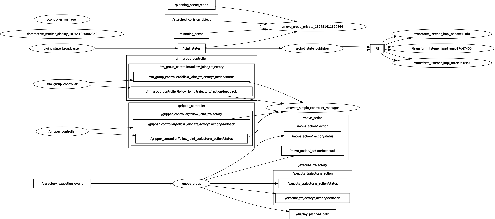

# 3.5 5분 CLI 드릴 — 조사 루틴을 손에 붙이기
```bash

$ros2 node list
/controller_manager
/gripper_controller
/interactive_marker_display_187651820802352
/joint_state_broadcaster
/move_group
/move_group_private_187651411670864
/moveit_simple_controller_manager
/rm_group_controller
/robot_state_publisher
/rviz
/rviz_private_281471420351456
/transform_listener_impl_aaaafff51fd0
/transform_listener_impl_aaab17dd7400
/transform_listener_impl_ffff2c0a18c0

$ros2 topic list | grep -i joint
/dynamic_joint_states
/gripper_controller/joint_trajectory
/joint_state_broadcaster/transition_event
/joint_states
/rm_group_controller/joint_trajectory

$ ros2 topic echo --once /joint_states
A message was lost!!!
	total count change:1
	total count: 1---
header:
  stamp:
    sec: 1785386783
    nanosec: 586311844
  frame_id: base_link
name:
- joint2
- joint3
- joint5
- joint1
- joint4
- joint7
- gripper_finger1_joint
- joint6
- gripper_finger2_joint
position:
- 1.658832230335008
- 2.0430195084418634
- 0.7808135391754564
- 1.9888753477272112
- 0.4708186051543802
- -3.84945224385066
- 0.04
- 1.9707319486984052
- 0.04
velocity:
- 0.0
- 0.0
- 0.0
- 0.0
- 0.0
- 0.0
- 0.0
- 0.0
- 0.0
effort:
- .nan
- .nan
- .nan
- .nan
- .nan
- .nan
- .nan
- .nan
- .nan
---

$ ros2 topic hz /joint_states
WARNING: topic [/joint_states] does not appear to be published yet
average rate: 99.875
	min: 0.003s max: 0.017s std dev: 0.00224s window: 102
average rate: 100.012
	min: 0.003s max: 0.017s std dev: 0.00209s window: 203
average rate: 100.007
	min: 0.003s max: 0.017s std dev: 0.00186s window: 303

$ ros2 action list
/execute_trajectory
/gripper_controller/follow_joint_trajectory
/move_action
/rm_group_controller/follow_joint_trajectory

$rqt_graph
```



